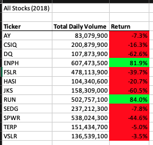
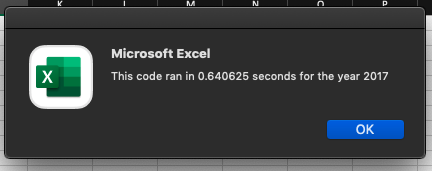

# stock-analysis

# Overview of project
## Background
VBA was used to automate analysis of stock datasets 
## Purpose 
The purpose of this project is to refactor the previous code in order to increase efficiency. The goal is to make the VBA script run faster by refactoring the code. Doing so will be better for larger datasets. We do this by altering the code, so the all the information needed is gathered while only looping though the dataset one time
# Results
## Yearly Stock Performance Comparison
Of the 12 stocks used in this analysis, the majority performed better in 2017 than in 2018.

 

In 2017, only one of the twelve stocks had a negative return. While in 2018, ten of the twelve analyzed had negative returns. In 2018, only two stocks had positive returns. 
## Code execution times
When comparing the execution times of the original script and the refactored script, it is clear that the refactored script runs faster. 

 

the execution time for the original code using the 2017 data set is 0.640625 seconds. the execution time for the refactored code using the 2017 data was 0.1640625 seconds. The refactored code is almost four times faster than the original code. 

 

the execution time of the original code for 2018 is 0.65625 seconds. While the refactored code speed is 0.15625 seconds. This is actually more than four times faster than the original code speed. 
# Summary
## Advantages
The are several advantages to refactoring code. refactoring code can make old code more efficient. refactored code can execute in fewer steps, use less memory, and be more user friendly. It can also make code applicable to more data sets. 
## Disadvantages 
the disadvantage to refactoring code is that it can be a long, time consuming process. It also may require a lot more retesting and debugging. 
## Application
I experienced both the advantages and disadvantages while refactoring this code. I was successful in making the code run faster than before. The code is also more streamlined now. However, it was a tedious process for me as a pesky typo kept me busy for several hours. 